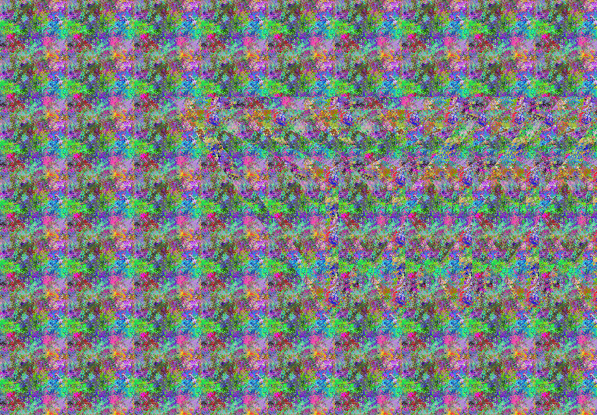

# pixbuilder

Pixel by pixel image construction

## Autostereogram

AutoStereoGram(ASG) are images that can be viewed as stereo image without resorting to any external device, see [Wikipedia](https://en.wikipedia.org/wiki/Autostereogram) 

ASG are computed using both a Pattern and a Depth-Map as input. Utilities are provided to generate these from standard png images.

See documentation and examples for more details.

## To do

Provide easily adjustable ways to maximize depth of stereo effect and adjust to screen/eye distance ?

Other image generation ideas : images using subimages as pixels ?
